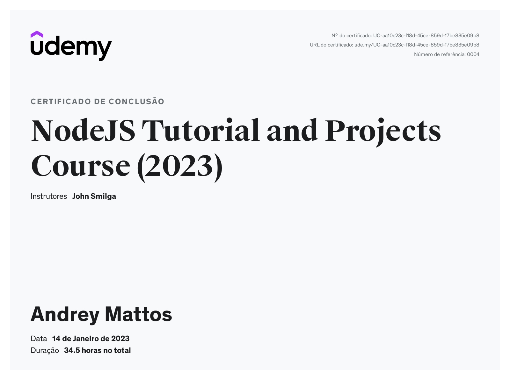

# Arquivos do [curso](https://www.udemy.com/course/nodejs-tutorial-and-projects-course/) de NodeJS

Aprendendo NodeJs construindo aplicações reais com NodeJs, Express, MongoDB, Mongoose, JWT e várias outras.

### Duração: 34,5 horas

### Curso consiste em:
- Node Tutorial
- Express Tutorial
- Projetos:
  - Gerenciador de tarefas
  - Store
  - JWT basics
  - Jobs API
  - Upload de arquivo
  - Envio de e-mail
  - Integração com meio de pagamento Stripe
  - E-commerce API
  - Auth Workflow

### Certificado:
